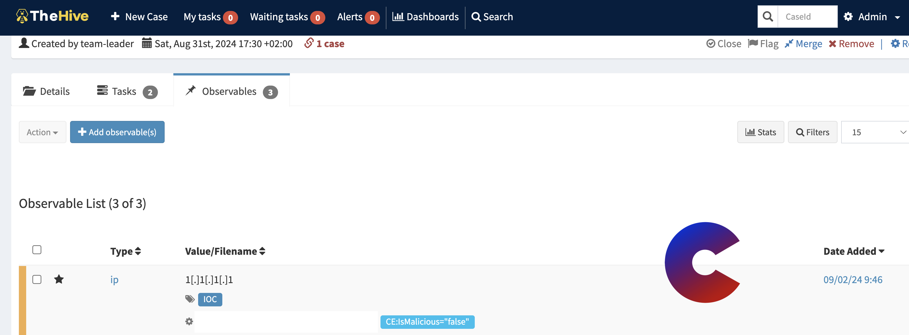
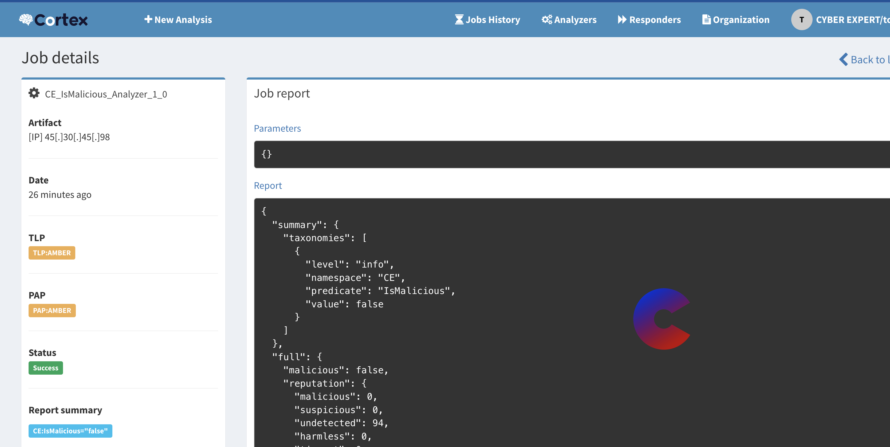

# Cortex-IsMalicious

# <p align="center">Welcome to Cortex IsMaliciious</p>
  
This project is based on the is malicious API developed by XXX, which you can find at https://ismalicious.com/.

This project proposes an implementation of the API in TheHive, with a few improvements still possible.
    
## 🧐 Features    

- Run a cortex IsMalicious job on IP
- Run a cortex IsMalicious job on DOMAIN
        
## 🛠️ Tech Stack
- [python](https://python.org/)
- [Cortex](https://docs.thehive-project.org/cortex/)


## 🛠️ Install  on python root package (depracated)
By default, when you install oython, you have a root environment that is global to the whole system.

Cortex presents different analyzers that are written with different versions of python and its dependencies, which may be incompatible with each other. 

If it's not a problem for us, you can simply make a :

```bash
pip3 install -r requirements.txt
```

And replace the first line of ismalicious.py :like this

```
## before 
#!/home/debian/myenv/ismalicious/bin/python3.9

## after
#!/usr/bin/env python3

```


## 🛠️ Install  on python virtual env
    

This is not explicitly mentioned in the Cortex documentation, which insists on using Docker, but you can (as I did) create a python environment and use the pip installer present in my environment.

For example, I've created a directory called myenv where I create a different environment for each analyzer :


```bash
mkdir -p /home/debian/myenv/ismalicious
```

Then I create a python environment in the myenv directory : 

```bash
cd /home/debian/myenv
python3 -m venv ismalicious
```

We can activate the environment :

```bash
source ismalicious/bin/activate
````

We can use our environment's pip3 tool to install dependencies locally without impacting python's root environment


```bash
./prefetch/bin/pip3 install -r requirements.txt
````


As shown in the first line of the  Cortex_Parse_Prefetch.py file, you must point execution to the python binary local to the environment :

```
## before 
#!/home/debian/myenv/ismalicious/bin/python3.9
```
           
## 🧑🏻‍💻 Usage Without Cortex
Not available

## 🧑🏻‍💻 Usage With Cortex/TheHive
        

## 🧐 The Next Features :

- Using api with credantials
- Implementation of thehive templates to improve user experience


## 🙇 Author
#### hack'im
- Linkedin: [@hak'im](https://www.linkedin.com/in/hakim-djelili/)